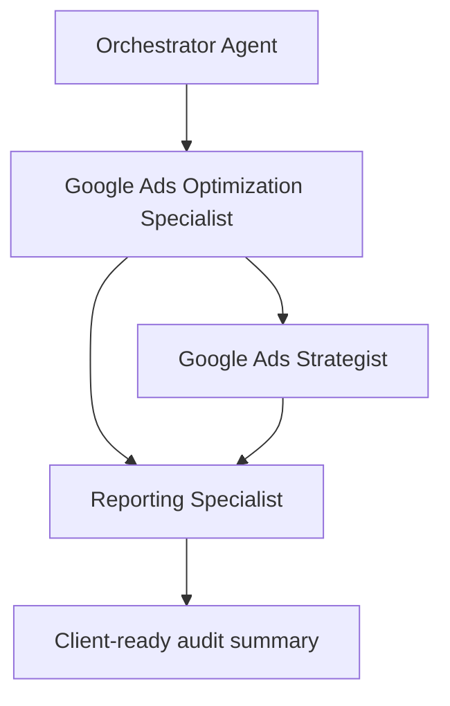

# Workflow: Google Ads Account Audit

<!-- deliverable: audit-report -->

## Goal

Assess the health of an existing Google Ads account and produce a prioritized list of improvements — the kind of "free audit" Saerens offers prospects, or a periodic deep-dive for an existing client.

## When to use

Onboarding a new client, a prospect requesting an audit, or a scheduled review of a live account that is underperforming or has gone untouched.

## Steps

1. Review the client context and goals (`clients/<client>.md`). For a **new client**, first align with the client on what matters most to them; for an **existing account**, plan a complete review of everything currently active and everything tested before.
2. Gather account-level performance data for the review period.
3. **Check conversion tracking first** — which conversions are measured, and whether they are measured correctly (`knowledge/measurement-reporting.md`). Nothing else can be trusted until this is sound. For a dedicated, standalone tracking health check, use `workflows/measurement-audit.md`.
4. Review account structure and settings against `knowledge/google-ads-standards.md`.
5. Review campaigns, ad groups, keywords, and search terms for **wasted spend and gaps** (commonly missing negative keywords).
6. Review what has been **tested in the past** so recommendations build on history instead of repeating failed tests.
7. Review ads and assets for quality and policy compliance.
8. Identify the biggest opportunities and risks.
9. Prioritize findings by expected impact and effort.
10. Prepare a clear, honest summary the client can understand.

## Saerens emphasis

- **Cover the basics first.** The most common and most damaging problems are broken or missing **conversion tracking** and **wasted budget** (often no negative keywords). Get these right before judging performance.
- **Conversions before performance.** Confirm conversions are measured, meaningful, and not double-counted before drawing any conclusion about how the account is doing.
- **New vs existing.** For new clients, start from what matters to them; for existing accounts, map what is active and what was already tested.
- **Deliver honestly and transparently** — plain language, no spin, with a clear sense of priority (quick wins vs. bigger fixes).

## Agent flow

## Agents involved

- Orchestrator Agent (routes and briefs)
- Google Ads Optimization Specialist (lead analyst)
- Google Ads Strategist (structural / strategic findings)
- Reporting Specialist (client-facing summary)

## Required output

Use `templates/google-ads-output.md` (audit variant), or `templates/audit-report.md` for a standalone audit deliverable. When the audit is presented as a slide deck, follow the Saerens deck layout standard (`knowledge/saerens-brand.md`). Must include:

- Overall account health summary
- Tracking & measurement findings
- Structure & settings findings
- Wasted spend and quick wins
- Prioritized recommendations (impact / effort)
- Missing data needed for a fuller audit
- Human approval required for any changes
