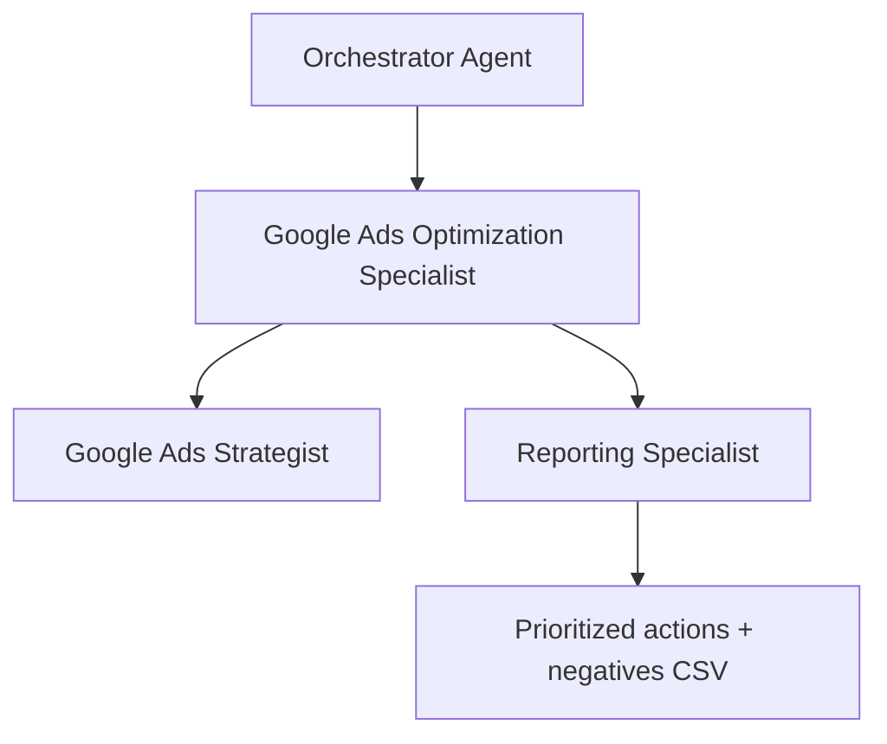

# Workflow: Google Ads Account Optimization (Weekly)

<!-- deliverable: negative-keywords-csv -->

## Goal

Run the recurring **weekly** optimization pass on a live Google Ads account: cut wasted spend, mine search terms for negatives, steer impression share and bidding toward the goal, and surface deeper analyst-grade insights — delivered as a prioritized action list plus an import-ready negatives CSV for human review.

## When to use

The standard **weekly** cadence for any active client account. For a one-off deep health check (new client, prospect, or a long-neglected account), use `workflows/account-audit.md` instead — that workflow validates tracking and structure from scratch; this one assumes those are already sound and focuses on ongoing performance.

## Steps

1. Review client context and goal (`clients/<client>.md`): target CPA/CPL or ROAS, budget constraints, and anything that changed since last week.
2. Pull this week's performance data and compare against recent weeks (spend, conversions, conversion value, CPC, CPA/ROAS, CTR) at account, campaign, and ad-group level.
3. **Trust the conversions first** (`knowledge/analytics-standards.md`). If tracking looks broken or the conversions can't be trusted, stop and flag it — never optimize on numbers you can't trust.
4. **Map the account's structure, then mine search terms → negatives.** First read how *this specific* account is organised, from the live campaign names and ad-group structure plus the client context: is it split by fine-grained search intent, by theme/service line, by brand vs non-brand, or barely segmented at all? Accounts segment differently (and some not at all) — read each account on its own terms, never assume one account's structure for another. Then review the search terms report and classify each flagged term: is it genuinely **irrelevant to the client's intent** (→ negative, Saerens' primary trigger), or **relevant but mis-routed** to the wrong campaign (→ a **cross-campaign negative** that frees the term for the campaign where it belongs — never a negative in that correct campaign)? Respect the client's documented service scope, and put **relevant-but-not-yet-converting** terms on **monitor**, not exclude. Default to excluding at **campaign level**; note where a shared list or ad-group-level negative would be cleaner (see `knowledge/google-ads-standards.md`).
   - **Cross-campaign routing — name both sides.** When a term is mis-routed, the cross-campaign negative is only half the action. Always also name the **positive add**: state the term, the **correct campaign and ad group** it should live in (use the live ad-group structure to pick a real ad group), and the suggested match type. Axel adds these by hand, so the analysis must name them explicitly — do not put positives in the negatives CSV.
5. **Impression share read.** The live optimization read provides this per campaign (search IS, lost to budget, lost to rank, top IS) — use those numbers. Check where impression share is lost (budget vs. rank) and frame it as a client decision: "we're losing X% to budget and Y% to rank — the options are raise budget, raise max CPC, or hold" (see `knowledge/google-ads-standards.md`).
6. **Bidding check.** Confirm the current bid strategy still fits where the account sits on the Saerens **bid strategy ladder** (`knowledge/google-ads-standards.md`); recommend a move up the ladder only when the conversion-volume and time-in-strategy conditions are met.
7. **Budget check.** Spot over-/under-pacing and wasted spend; recommend shifts, always flagged for client approval.
8. **Deeper analytical pass.** Go beyond the surface the way a real analyst would. The live read provides device, day-of-week, hour-of-day and geo (region) splits — read them for patterns (e.g. a device or daypart with a structurally higher CPA, a region that wastes spend). Read trends over time, not just this week's snapshot; question whether a "good" number is real or a vanity metric, and whether an apparent difference is statistically meaningful or just noise (`knowledge/experimentation-standards.md`). The weekly value is in this richer read, not a list of obvious tweaks.
9. **Prioritize** every recommendation by expected impact vs. effort.
10. Prepare the output: a prioritized action list, the deeper insights, and the negatives to export.

## Saerens emphasis

- **Read each account's structure before judging terms.** Accounts segment differently — by search intent, by theme, by brand, or not at all. Derive the model from the live campaign names + client context, then decide whether a term is genuinely irrelevant (negative) or relevant-but-mis-routed (cross-campaign negative). Never assume one account's structure for another.
- **Relevance drives negatives**, not just spend — exclude search terms that don't match the client's intent, by default at campaign level. A relevant term that simply hasn't converted yet is **monitor**, not exclude; never negative a term that matches the client's documented service scope.
- **Monitor before exclude — escalate by fixing, not cutting.** A relevant term that isn't converting is never excluded outright. First address the cause: the **landing page** (relevance, speed, message match) or the **bid** (too low to win the searches that matter). Only if those interventions are made and the term *still* fails to convert over time does it become a candidate for exclusion. The monitor list persists across weeks so stale terms surface with their age instead of lingering unseen.
- **Impression share is a client conversation**, not a silent lever — show the loss and the trade-off (budget vs. max CPC) and let the client decide.
- **Earn the next bid strategy.** Climb the ladder (Maximize Clicks → Maximize Conversions → Target CPA) only when conversion volume is consistent over time; don't jump ahead.
- **Analyst depth over surface metrics.** The recurring value is the deeper read, not a checklist of obvious changes.
- **Nothing goes live without a human.** Every spend or live-setting change is a recommendation only; a human implements, and the client approves budget changes.

## Monitor list (persistent across weeks)

The system tracks monitored terms in the database and re-injects them into each run as a "Monitor list" section with each term's age (`weeks monitored`) and any prior action. Use it to apply the escalation rule above: the older a relevant-but-not-converting term gets, the more decisive the intervention (landing page → bid → only then a candidate for exclusion).

To keep the list current, the optimization specialist must end its analysis with a **machine-readable monitor block** — an HTML comment that does not render to the user. List every term that should stay on (or join) the monitor list, plus any you are closing out:

```
<!-- monitor-list
[
  {"term": "dakgoot reinigen prijs", "campaign": "SEARCH | Dakgoten", "reason": "relevant, clicks but no conversions yet", "suggestedAction": "landing-page", "status": "monitoring", "note": "week 2 - test new LP"},
  {"term": "gratis offerte", "campaign": "SEARCH | Dakpannen", "reason": "converted this week", "status": "resolved"}
]
-->
```

- `status` is `monitoring` (keep tracking), `resolved` (converted / no longer a concern), or `excluded` (escalation exhausted — also add it to the negatives CSV).
- `suggestedAction` names the next escalation step: `landing-page`, `bid`, or `exclude-candidate`.
- Re-emit terms already on the list each week (their age auto-increments); omit nothing you still want tracked.

## Agent flow



## Agents involved

- Orchestrator Agent (routes and briefs)
- Google Ads Optimization Specialist (lead analyst)
- Google Ads Strategist (structural / strategic input when needed)
- Reporting Specialist (client-facing wording when results are shared)

## Required output

Use `templates/google-ads-output.md` (optimization variant). Must include:

- Performance summary vs. goal
- Key findings (data-backed) and deeper analytical insights
- Search-term actions and negatives to add (with exclusion level)
- Cross-campaign routing: for each mis-routed term, both the cross-campaign negative AND the positive add (term → correct campaign + ad group + match type)
- Monitor list: relevant-but-not-converting terms with their age and next escalation step (landing page / bid), closed out only when exclusion is earned
- Impression share read and the budget vs. rank trade-off
- Bidding & budget recommendations with rationale (ladder position)
- Prioritized action list (impact / effort)
- Missing data needed for a more confident call
- Human approval required for any spend or live change
- **Negatives CSV** — an import-ready negative keyword list for Google Ads Editor, for a human to review and bulk-upload
