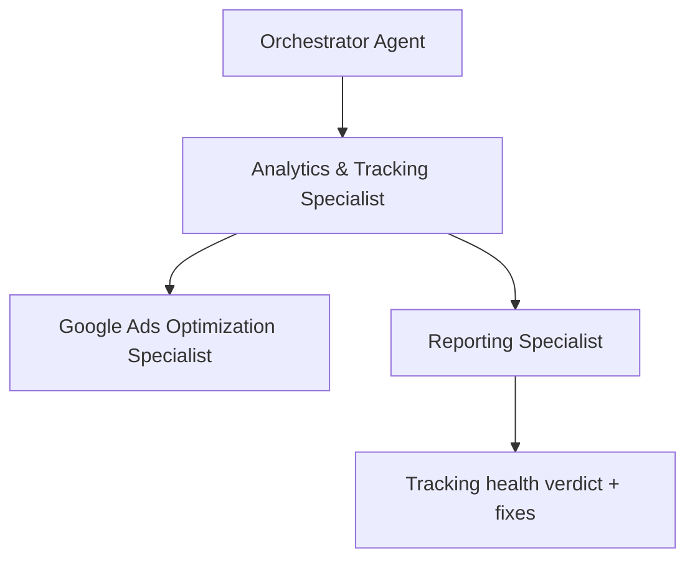

# Workflow: Measurement Audit (Conversion-Tracking Health Check)

<!-- deliverable: audit-report -->

## Goal

Verify that an existing account's measurement is trustworthy *before* anyone optimizes or reports on it. This is a focused health check of live conversion tracking — not a plan for new tracking (that is `workflows/tracking-setup.md`) and not a full account review (that is `workflows/account-audit.md`). It exists because optimizing or reporting on broken data wastes weeks; this catches it first.

## When to use

Onboarding a live account, before the first monthly report or weekly optimization on a new account, after a website or tag change, or whenever the data looks suspicious — spend with no conversions, an implausible spike, or conversions that do not match the client's reality.

## Steps

1. Review the client context and what counts as a real conversion for them (`clients/<client>.md`).
2. Establish the measurement baseline against `knowledge/measurement-reporting.md`: which conversion actions *should* exist for this client's world (e-commerce vs lead generation), and what value each should carry.
3. Read the live, read-only account data and the automatic signals already computed (spend-without-conversions, CPA outliers). Treat **spend without any conversions** as a tracking-failure suspect first, not a performance problem.
4. Check each conversion action: is it defined, firing, firing **only once**, and assigned a meaningful value? Are GA4 and Google Ads aligned on what a conversion is? Are phone calls tracked where calls matter?
5. Look for the common failure modes: missing tag after a site change, duplicate counting, test/internal traffic polluting data, primary conversions set to low-value or pageview-style actions, and consent/privacy handling that silently drops data.
6. Classify every finding by severity — **blocking** (data cannot be trusted at all), **degrading** (some metrics unreliable), or **minor** — and state the concrete fix and who must do it.
7. State explicitly whether the account's data is **safe to optimize and report on yet**. If not, that is the only headline that matters.

## Saerens emphasis

- **Conversions before performance.** Nothing else can be trusted until measurement is sound — this is the first thing Saerens checks in any account.
- **Spend without conversions is a tracking suspect first.** Rule out broken measurement before concluding the campaigns are failing.
- **Never optimize or report on blind data.** A blocking tracking finding outranks every optimization idea until it is fixed.
- **Be explicit about gaps.** Mark what cannot be verified as "not available" rather than assuming it works.

## Agent flow

## Agents involved

- Orchestrator Agent (routes and briefs)
- Analytics & Tracking Specialist (lead — measurement health)
- Google Ads Optimization Specialist (impact of any data gaps on optimization)
- Reporting Specialist (client-facing wording, where shared)

## Required output

Use `templates/audit-report.md` (measurement variant). Must include:

- A one-line verdict: is the account's data safe to optimize and report on?
- Conversion actions checked, with status (defined / firing / valued / aligned)
- Findings by severity (blocking / degrading / minor) with the concrete fix and owner
- What could not be verified and why (missing data)
- Human approval required before any tracking change goes live
